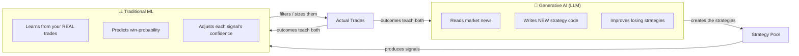
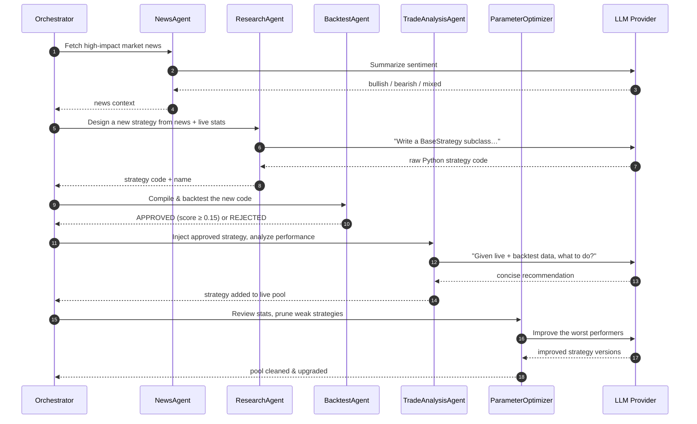
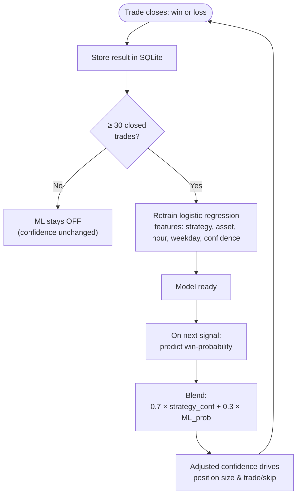
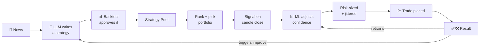
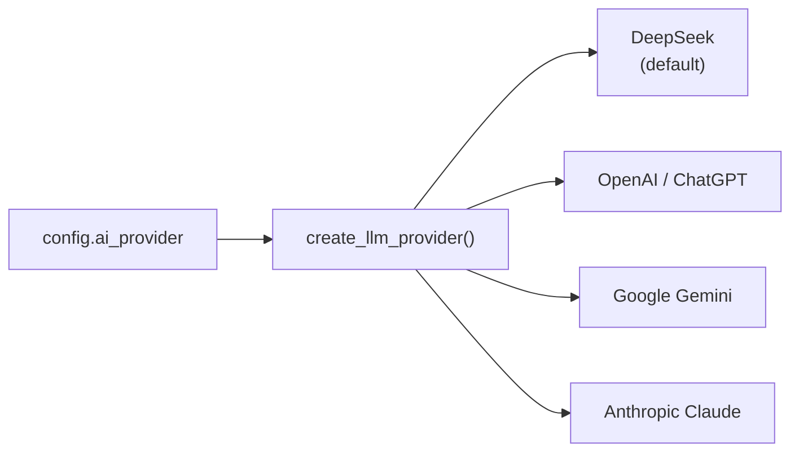

# AI Workflow — End to End

> How **binary-quant-trader** actually uses AI. There are **two different kinds of AI** here,
> and they do *different jobs*. Understanding that split is the key to understanding the project.

---

## The big idea: two AIs, two jobs

| | Generative AI (LLM) | Traditional ML |
|--|--------------------|----------------|
| **Job** | *Invents* trading strategies | *Judges* which signals actually win |
| **Tech** | DeepSeek / OpenAI / Gemini / Claude | Logistic regression (scikit-learn) |
| **Input** | News + live performance | Your closed-trade history |
| **Output** | Python strategy code | A win-probability (0–1) per signal |
| **Analogy** | The *creative researcher* | The *skeptical risk analyst* |

> **Why both?** An LLM is great at generating ideas but can't know if they work on *your* account.
> A small ML model can't invent strategies, but it *can* learn, from your real results, which
> ideas are actually paying off — and quietly turn down the volume on the ones that aren't.

---

## Part A — The generative AI loop (multi-agent)

Every cycle (~60s, or an "express" cycle when a strategy is losing live), six agents run in
sequence. This is what *creates and maintains* the strategy pool.

**The six agents:**

| Agent | What it does |
|-------|--------------|
| **OrchestratorAgent** | Master controller — runs the cycle, dispatches the others. |
| **NewsAgent** | Pulls headlines (NewsAPI), asks the LLM for sentiment. |
| **ResearchAgent** | Asks the LLM to *write brand-new strategy code* from context. |
| **BacktestAgent** | Compiles that code and backtests it; approves or rejects. |
| **TradeAnalysisAgent** | Injects approved strategies live; asks the LLM for advice. |
| **ParameterOptimizer** | Prunes consistently-losing strategies; asks the LLM to improve them. |

> ⚠️ **Honest note:** the LLM writes *plausible-looking* strategies, but "plausible" ≠ "profitable."
> The BacktestAgent is the guardrail — but it validates on small samples, so approved strategies
> can still be overfit. This is why the traditional-ML layer (Part B) exists as a second filter.

---

## Part B — The traditional ML loop (meta-labeling)

While the LLM *creates* strategies, a logistic-regression model *learns which ones actually win* on
your account, and adjusts confidence accordingly. This is classic quant **meta-labeling**.

**How the blend works in practice:**

- A strategy says: *"CALL on EUR/USD, 68% confident."*
- The ML model has seen this strategy lose most mornings on EUR/USD, and says: *"win-prob ≈ 30%."*
- Blended confidence drops (`0.7×0.68 + 0.3×0.30 ≈ 0.57`), so the trade is smaller — or skipped.
- If the ML model instead *agrees* (win-prob 75%), confidence holds and the trade is full-size.

> The model activates only after **30+ closed trades** with both wins and losses. Before that, it's a
> no-op and confidence passes through untouched — you'll see **"ML learning · N/30"** in the dashboard.

---

## Part C — Putting it together (one full cycle)

**The feedback loop is the whole point:** every result makes the ML model smarter *and* tells the
LLM agents which strategies to fix. The system is designed to *adapt*, not to be right on day one.

---

## Choosing / switching the AI provider

DeepSeek is the default. You can switch in the dashboard's config panel, or via `AI_PROVIDER` in
`.env`. All providers implement the same interface (`backend/agents/llm_providers/base.py`), so the
rest of the system doesn't care which one you use.

| Provider | Default model | Get a key |
|----------|---------------|-----------|
| `deepseek` | `deepseek-chat` | https://platform.deepseek.com |
| `openai` | `gpt-4o-mini` | https://platform.openai.com |
| `gemini` | `gemini-2.0-flash` | https://aistudio.google.com |
| `anthropic` | `claude-sonnet-4-5` | https://console.anthropic.com |

---

*See also: **[ARCHITECTURE.md](ARCHITECTURE.md)** (system structure) and
**[GETTING_STARTED.md](GETTING_STARTED.md)** (setup from zero).*
