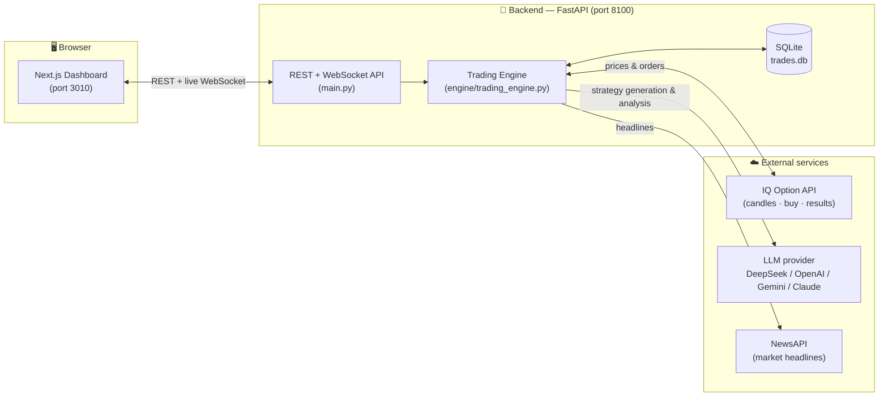
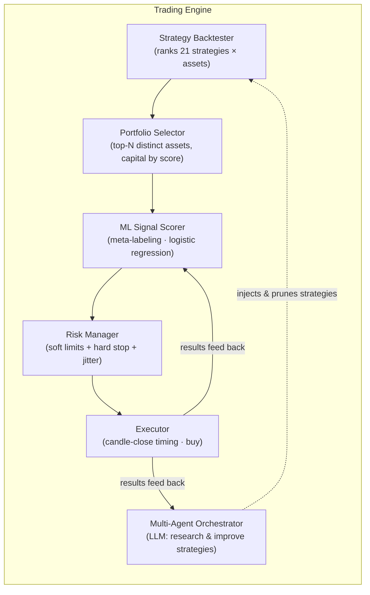

# Architecture

> Visual, end-to-end map of how **binary-quant-trader** is put together.
> All diagrams below are [Mermaid](https://mermaid.js.org/) — GitHub renders them automatically.

---

## 1. System overview

Two apps talking over REST + WebSocket, with three external services behind the backend.



---

## 2. Inside the Trading Engine

The engine is the brain. It runs several loops on background threads and coordinates the
two AI layers, risk, and execution.



**Who does what:**

| Component | File | Responsibility |
|-----------|------|----------------|
| Backtester | `backend/backtesting/backtester.py` | Walk-forward simulation, composite scoring, ranking. |
| Portfolio selector | `backend/engine/trading_engine.py` | Picks top distinct-asset combos, splits capital by score. |
| ML signal scorer | `backend/ml/signal_scorer.py` | Learns which combos win from real history; adjusts confidence. |
| Risk manager | `backend/risk/risk_manager.py` | Position sizing, soft warnings, hard-stop kill switch, jitter. |
| Orchestrator | `backend/agents/orchestrator.py` | LLM agents that write, test, and prune strategies. |
| LLM providers | `backend/agents/llm_providers/` | Swappable DeepSeek / OpenAI / Gemini / Anthropic clients. |
| IQ client | `backend/connection/iq_client.py` | Broker connection, candles, orders, results. |

---

## 3. One trade, end to end

What actually happens around a single candle close.

```mermaid
sequenceDiagram
    autonumber
    participant Loop as Trade Loop
    participant Port as Portfolio
    participant Strat as Strategy
    participant ML as ML Scorer
    participant Risk as Risk Manager
    participant IQ as IQ Option
    participant DB as Database

    Loop->>Loop: Wait until ~10s before candle close
    Loop->>Port: Which combos are active?
    Port-->>Loop: Top-N assets + capital weights
    loop for each portfolio combo
        Loop->>Strat: generate_signal on candles
        Strat-->>Loop: direction + confidence
        Loop->>ML: blend confidence with win-history
        ML-->>Loop: adjusted confidence
        Loop->>Risk: position size for this weight?
        Risk-->>Loop: size (with ±3% jitter)
    end
    Loop->>Loop: Wait for exact candle close (randomized offset)
    Loop->>IQ: buy(asset, direction, size)
    IQ-->>Loop: order_id
    Loop->>DB: save trade
    Note over Loop,DB: On expiry, result is fetched,<br/>stored, and fed back to ML + orchestrator
```

---

## 4. Tech stack

| Layer | Tech |
|-------|------|
| Backend | Python 3.11 · FastAPI · SQLAlchemy (SQLite) · scikit-learn · pandas / numpy · httpx |
| Frontend | Next.js 14 · React · TypeScript · Tailwind CSS · Recharts |
| Broker | [`iqoptionapi`](https://github.com/iqoptionapi/iqoptionapi) |
| Realtime | WebSocket (engine → dashboard) |

---

## 5. Directory map

```
backend/
  main.py                 FastAPI app (REST + WebSocket endpoints)
  config/                 settings + asset catalog
  connection/             IQ Option client wrapper
  engine/                 trading engine (portfolio, live loop, rotation)
  strategies/             21 built-in technical strategies
  backtesting/            walk-forward backtester + ranking
  ml/                     traditional ML signal scorer (meta-labeling)
  agents/
    llm_providers/        swappable LLM clients (deepseek/openai/gemini/anthropic)
    orchestrator.py       multi-agent strategy research loop
  risk/                   risk manager + kill switch
  news/                   NewsAPI fetcher
  database/               SQLAlchemy models + SQLite access
frontend/
  app/                    Next.js pages
  components/             dashboard UI (portfolio, trades, agents, strategies…)
  hooks/                  bot state + WebSocket hooks
  lib/                    API client + strategy catalog
docs/                     you are here
run.py                    one-command launcher for both servers
```

For the AI-specific flow (agents + ML), see **[AI_WORKFLOW.md](AI_WORKFLOW.md)**.
To set it up from zero, see **[GETTING_STARTED.md](GETTING_STARTED.md)**.
